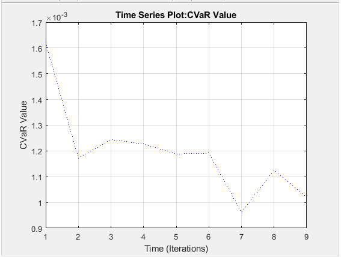

[](http://quantlet.de/)

```yaml
Name of QuantLet: Plotting the CVaR for the different sets of initial weights

Description: 'Varying all combinations of initial weights to determine which one leads to a minimal CVaR'

Keywords: initial weights, combinations, minimal CVaR

Author: Georg Velev, Iliyana Pekova

Submitted: Thu, July 25 2019 by Georg Velev, Iliyana Pekova

Output: 'initial_weights in .PNG format'
```




### MATLAB code
```matlab
%plot as time  series (minimum easy to see, however no convergence)
load count.dat
count1 = timeseries(mat(:,5),1:9);
count1.Name = 'CVaR Value';
count1.TimeInfo.Units = 'Iterations';
plot(count1,':b')
grid on
```
